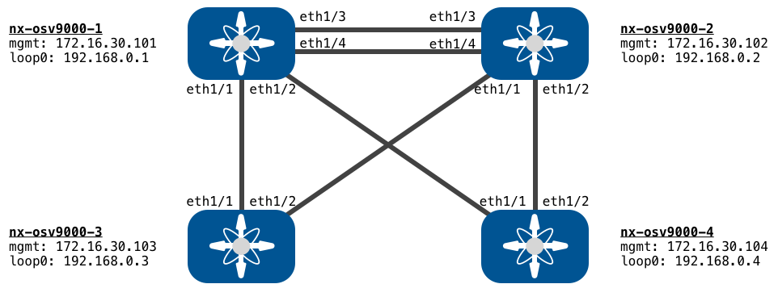

# DevNet Open NX-OS Sandbox

Here you will find Sample Code, Scripts and Information for use in the DevNet [Open NX-OS Sandbox]().  



[DevNet Sandboxes](http://developer.cisco.com/sandbox) are all about providing an environment where developers can explore and test out whatever they are learning or working on.  But sometimes having a starting point, or inspiration can be helpful, and that's what this repository is all about.  

And should you develop some interesting code targeting the Sandbox and want to share with the community, we'd love to include it here!!! Just fork the repo and review our [Pull Request instructions](pull-requests.md).  

# Repo Resources 

## Sandbox Management

This DevNet Sandbox leverages VIRL for building and managing the environment, however there is no need for you as the user to be familiar with VIRL to leverage the Sandbox resources.  

Should you run into issues with one or more of the nodes in the sandbox, or simply wish to restart the full environment you can leverage [virlutils](https://github.com/CiscoDevNet/virlutils) to manage the simulation.  

Here is a simple walkthrough of managing the network.  

1. In the `sbx_nxos` directory you'll see a file [`topology.virl`](topology.virl).  This file is the network definition for the simulation.  
1. If you are working from your own local workstation, and not the provided DevBox in the reservation, you'll need to setup `virlutils` before continuing.  
    1. Install `virlutils` with `pip install virlutils` 
    2. Find the name of the simulation environment with `virl ls --all` 

        ```bash
        Running Simulations
        ╒═════════════════════════╤══════════╤════════════════════════════╤═══════════╕
        │ Simulation              │ Status   │ Launched                   │ Expires   │
        ╞═════════════════════════╪══════════╪════════════════════════════╪═══════════╡
        │ sbx_nxos_default_0EAiXi │ ACTIVE   │ 2018-08-06T19:27:41.297570 │           │
        ╘═════════════════════════╧══════════╧════════════════════════════╧═══════════╛
        ```    

    3. Activate this simluation for `virlutils`  with `virl use SIMULATION_NAME`.  For example: 

        ```bash
        $virl use sbx_nxos_default_0EAiXi
        Now using VIRL simulation sbx_nxos_default_0EAiXi
        ```
    
1. View the nodes that are running. 

    ```bash
    $ virl nodes 
    
    ╒══════════════╤═════════════╤═════════╤═════════════╤════════════╤══════════════════════╤════════════════════╕
    │ Node         │ Type        │ State   │ Reachable   │ Protocol   │ Management Address   │ External Address   │
    ╞══════════════╪═════════════╪═════════╪═════════════╪════════════╪══════════════════════╪════════════════════╡
    │ nx-osv9000-1 │ NX-OSv 9000 │ ACTIVE  │ REACHABLE   │ telnet     │ 172.16.30.101        │ N/A                │
    ├──────────────┼─────────────┼─────────┼─────────────┼────────────┼──────────────────────┼────────────────────┤
    │ nx-osv9000-2 │ NX-OSv 9000 │ ACTIVE  │ REACHABLE   │ telnet     │ 172.16.30.102        │ N/A                │
    ├──────────────┼─────────────┼─────────┼─────────────┼────────────┼──────────────────────┼────────────────────┤
    │ nx-osv9000-3 │ NX-OSv 9000 │ ACTIVE  │ REACHABLE   │ telnet     │ 172.16.30.103        │ N/A                │
    ├──────────────┼─────────────┼─────────┼─────────────┼────────────┼──────────────────────┼────────────────────┤
    │ nx-osv9000-4 │ NX-OSv 9000 │ ACTIVE  │ REACHABLE   │ telnet     │ 172.16.30.104        │ N/A                │
    ╘══════════════╧═════════════╧═════════╧═════════════╧════════════╧══════════════════════╧════════════════════╛
    ```

1. You can connect to individual nodes Console or VTY Lines with `virl console NODE` or `virl ssh NODE` or `virl telnet NODE`.  

    ```bash
    $virl ssh nx-osv9000-1
    Attemping ssh connectionto nx-osv9000-1 at 172.16.30.101
    Warning: Permanently added '172.16.30.101' (RSA) to the list of known hosts.
    User Access Verification
    Password:
    ```

1. If you look at `virl --help`, you'll see you can also `virl start` and `virl stop` individual nodes should there be a problem.  
1. Finally, you can completely restart the simulation by first `virl down` followed by `virl up`.  This will destroy and restart the simulation.  

For more information on how to use `virlutils` to manage this and other VIRL/CML simulations, see the [documentation on GitHub](https://github.com/CiscoDevNet/virlutils).

## Learning Labs

This sandbox is leveraged in different NX-OS Learning Labs.  Within the [learning_labs](learning_labs/) directory are different code samples used in these learning labs.  Feel free to explore these samples on their own, or use the sandbox along with the Learning Labs.  

## Ansible Playbooks

Ansible is a great technology for Configuration Management of the network, and we've provided some sample playbooks to take a look at.  Take a look at what's available here:  [ansible-playbooks/README.md](ansible-playbooks/README.md).  

## NX-API REST Examples

Interested in using NX-API?  Checkout samples here: [nx-api/README.md](nx-api/README.md)

*Coming Soon!!!*

## Standard Model Driven Programmability with YANG

Looking for details on YANG Data Models and using NETCONF, RESTCONF, or gRPC with NX-OS?  Checkout samples here: [yang/README.md](yang/README.md)

*Coming Soon!!!*

## Guest Shell Use Cases

Want to run Linux utilities and apps on your Nexus devices?  Checkout samples here: [guestshell/README.md](guestshell/README.md)

*Coming Soon!!!*

## Other Use Cases

Interested in what else is possible?  Checkout ideas here: [other/README.md](other/README.md)

*Coming Soon!!!*
