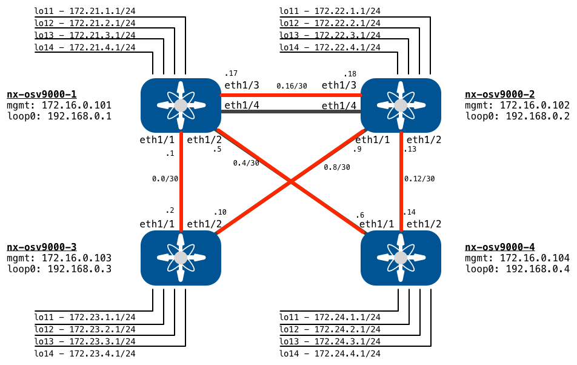

# Open NX-OS Sandbox Sample Ansible Playbooks 

So you are interested in leveraging Ansible for configuration management of your NX-OS devices and are kicking the tires using the [Open NX-OS Sandbox]().  Well, you are in the right place!  


Here you will find some sample playbooks to deploy common configurations and topologies that are all ready to run against the Sandbox.  Just clone down the repository and jump right in.  

### Quick Links 

* [Code and Ansible Setup](#code-and-ansible-setup)
* [Sample Topologies and Configs](#sample-topologies-and-configs)
    * [Basic Layer 3 Fabric](#basic-layer-3-fabric)
    * [Basic Layer 2 Fabric](#basic-layer-2-fabric) - *Coming Soon!*
    * [Switch Admin Tasks](#switch-admin-tasks)

# Code and Ansible Setup 

Before you can run your first playbook, you need to: 

1. [Reserve and connect to a Sandbox]()
2. Download/clone the sample code repository 
3. Setup your workstation for Ansible.  

## Get the Sample Code

The simplest way to get the code is to just `git clone` it to your local machine.  

```bash
# from the directory where you want to put the code 
git clone https://github.com/DevNetSandbox/sbx_nxos 
cd sbx_nxos
```

If you'd like to get your very own copy of the repository that you can update or add code to, you may want to "Fork" the repo and clone down your own copy.  And please submit Pull Requests for anything cool you build in the Sandbox!  

### Download with out git 

If you'd rather just download the code without mucking around with `git`, you can do that too.  Just hit this link to download a zip file with the code:  [DevNetSandbox/sbx_nxos/archive/master.zip](https://github.com/DevNetSandbox/sbx_nxos/archive/master.zip)

## Setup Ansible 

Ansible is written in Python which means you set it up using the same steps as any Python application.  Like other Python projects, we highly recommend leveraging [Virtual Environments](http://docs.python-guide.org/en/latest/dev/virtualenvs/) with Ansible for the best experience.  

Follow these steps to create a virtual environment and install the requirements.  

```bash
# Here we explicitly create the venv with Python 3
virtualenv venv --python=python3
source venv/bin/activate 
pip install -r requirements.txt
```

Now Ansible is installed and ready to go.  One last step before running any of the sample playbooks is to tell Ansible about the target hosts in the sandbox, and the credentials to use to access.  

For the hosts part, included in the directory is `ansible.cfg` (see it [here](ansible.cfg)).  This is a standard Ansible file that identifies the default location of the inventory.  By including the file within the directory, Ansible will use the [hosts](hosts) file located within the repo.  

For the credentials, simply run this command to set a series of local environment variables for Ansible to use.  See the file here: [.ansible_env](.ansible_env)

```bash
source .ansible_env
```

# Sample Topologies and Configs

Here is a list of the different topologies and configuration details.  

* [Basic Layer 3 Fabric](#basic-layer-3-fabric)
    * This is a sample network configuration that deploys Layer 3 (routed) links between all the switches in the topology along with routing protocol (OSPF and/or BGP)

# Basic Layer 3 Fabric



Within the [basic\_l3\_network](basic_l3_network) folder are a series of Ansible Playbooks that will configure the Sandbox for a Basic Layer 3 Fabric with either OSPF or eBGP as the routing protocol.  

### Notes:  

- Point to Point Routed Links are /30s from 172.17.0.0/24
- Each switch has 4 Loopbacks configured for route injection 

### Network Configuration Details

The playbooks in this configuration leverage details such as interfaces to configure, IP addresses, and routing protocol details that are stored in group and host variables.  You can find these details within the following folders.  

* [host_vars](host_vars): A file for each switch contains host specific details
* [group_vars](group_vars): The `all.yml` file contains details available for any host

### Playbooks Included

* [full\_ospf.yml](basic_l3_network/full_ospf.yml)
    * Fully deploy an OSPF network by running the following in this order
        * [l3\_fabric\_ip\_addresses.yml](basic_l3_network/l3_fabric_ip_addresses.yml)
        * [local\_loopback\_networks.yml](basic_l3_network/local_loopback_networks.yml)
        * [l3\_fabric\_ospf\_routing.yml](basic_l3_network/l3_fabric_ospf_routing.yml)
* [full\_bgp.yml](basic_l3_network/full_bgp.yml)
    * Fully deploy an BGP network by running the following in this order
        * [l3\_fabric\_ip\_addresses.yml](basic_l3_network/l3_fabric_ip_addresses.yml)
        * [local\_loopback\_networks.yml](basic_l3_network/local_loopback_networks.yml)
        * [l3\_fabric\_bgp\_routing.yml](basic_l3_network/l3_fabric_bgp_routing.yml)
* [full\_remove.yml](basic_l3_network/full_remove.yml)
    * Fully remove the configuration by running the following in this order
        * [l3\_fabric\_bgp\_routing\_remove.yml](basic_l3_network/l3_fabric_bgp_routing_remove.yml)
        * [l3\_fabric\_ospf\_routing\_remove.yml](basic_l3_network/l3_fabric_ospf_routing_remove.yml)
        * [local\_loopback\_networks\_remove.yml](basic_l3_network/local_loopback_networks_remove.yml)
        * [l3\_fabric\_ip\_addresses\_remove.yml](basic_l3_network/l3_fabric_ip_addresses_remove.yml)
* [l3\_fabric\_ip\_addresses.yml](basic_l3_network/l3_fabric_ip_addresses.yml)
    * Deploy the Point to Point IP addresses on all the switches
* [l3\_fabric\_ip\_addresses\_remove.yml](basic_l3_network/l3_fabric_ip_addresses_remove.yml)
    * Remove the Point to Point IP addresses on all the switches
* [local\_loopback\_networks.yml](basic_l3_network/local_loopback_networks.yml)
    * Deploy local loopbacks onto all the switches 
* [local\_loopback\_networks\_remove.yml](basic_l3_network/local_loopback_networks_remove.yml)
    * Remove the local loopbacks from all the switches
* [l3\_fabric\_ospf\_routing.yml](basic_l3_network/l3_fabric_ospf_routing.yml)
    * Deploy OSPF as the routing protocol to all switches
    * Requires that the following playbooks have run
        * [l3\_fabric\_ip\_addresses.yml](basic_l3_network/l3_fabric_ip_addresses.yml)
        * [local\_loopback\_networks.yml](basic_l3_network/local_loopback_networks.yml)
* [l3\_fabric\_ospf\_routing\_remove.yml](basic_l3_network/l3_fabric_ospf_routing_remove.yml)
    * Remove OSPF from all switches
* [l3\_fabric\_bgp\_routing.yml](basic_l3_network/l3_fabric_bgp_routing.yml)
    * Deploy eBGP as the routing protocol to all the switches
    * Requires that the following playbooks have run
        * [l3\_fabric\_ip\_addresses.yml](basic_l3_network/l3_fabric_ip_addresses.yml)
        * [local\_loopback\_networks.yml](basic_l3_network/local_loopback_networks.yml)
* [l3\_fabric\_bgp\_routing\_remove.yml](basic_l3_network/l3_fabric_bgp_routing_remove.yml)
    * Remove BGP from all switches

## Deploying Configuration 

To deploy the configuration to the Sandbox follow these steps.   

### Deploy OSPF Configuration

```bash
# from the sbx-nxos directory
# activate the venv 
source venv/bin/activate 

# source the switch credentials
source .ansible_env

# enter the playbook directory
cd ansible-playbooks

# run the full deploy playbook
ansible-playbook basic_l3_network/full_ospf.yml
```

### Deploy BGP Configuration

```bash
# from the sbx-nxos directory
# activate the venv 
source venv/bin/activate 

# source the switch credentials
source .ansible_env

# enter the playbook directory
cd ansible-playbooks

# run the full deploy playbook
ansible-playbook basic_l3_network/full_bpg.yml
```

### Run an individual playbook

```bash
# from the sbx-nxos directory
# activate the venv 
source venv/bin/activate 

# source the switch credentials
source .ansible_env

# enter the playbook directory
cd ansible-playbooks

# run the playbook of choice
ansible-playbook basic_l3_network/<PLAYBOOK.yml>
```


### Remove the Configuration

```bash
# from the sbx-nxos directory
# activate the venv 
source venv/bin/activate 

# source the switch credentials
source .ansible_env

# enter the playbook directory
cd ansible-playbooks

# run the full remove playbook
ansible-playbook basic_l3_network/full_remove.yml
```

# Basic Layer 2 Fabric

*Coming Soon!*

# Switch Admin Tasks

Here are some basic switch administration playbooks included.  Some of these are actually used as part of the Sandbox preparation tasks.  

* [set\_boot\_image.yml](#set\_boot\_image.yml )

### set\_boot\_image.yml 

The playbook [switch\_admin/set\_boot\_image.yml](switch_admin/set_boot_image.yml) sets the `boot nxos` configuration on the switches using the `nxos_config` module.  

This playbook is leveraged as part of the Sandbox setup process to ensure the switches reload successfully should you restart them during testing.  

To execute the playbook: 

```bash
# from the sbx-nxos directory
# activate the venv 
source venv/bin/activate 

# source the switch credentials
source .ansible_env

# enter the playbook directory
cd ansible-playbooks

# run the full remove playbook
ansible-playbook switch_admin/set_boot_image.yml
```